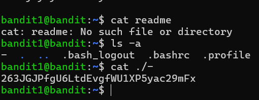
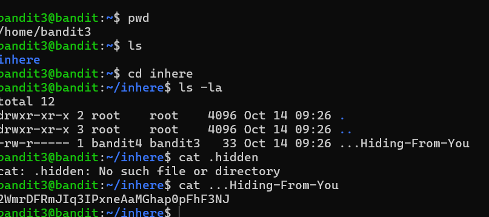
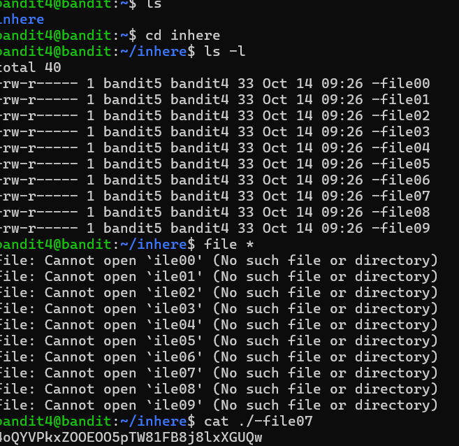
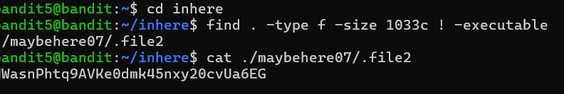
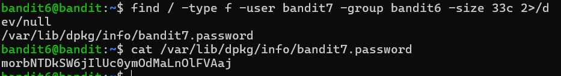
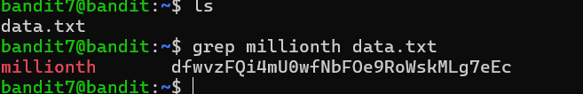
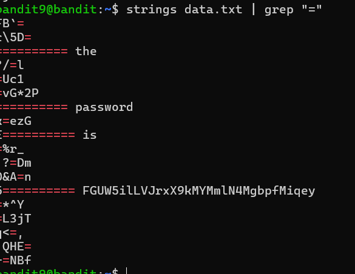

```
# OverTheWire Bandit Write-ups (Levels 0–9)

## Level 0-1

This level involves logging into the game using SSH.

SSH (Secure Shell) is a cryptographic network protocol used for securely connecting to and managing remote servers over an unsecured network. It provides a secure, encrypted method for logging in and executing commands on a remote machine, as well as for transferring files safely.  

For this level, the host is `bandit.labs.overthewire.org`, the port is `2220`. The username is `bandit0` and the password is `bandit0`.

### 🔹 Commands Used
ssh bandit0@bandit.labs.overthewire.org -p 2220
ls
cat readme

### 🔹 Screenshot


---

## Level 1-2

The password for this level is stored in a file called `-` in the home directory.  
Since `-` is treated as standard input, we use `./-` to explicitly read it from the current directory.

### 🔹 Commands Used
ls
cat ./-

### 🔹 Screenshot


---

## Level 2-3

The password for this level is stored in a file called `spaces in this filename` in the home directory.  
Backslashes or quotes are used to handle spaces in filenames.

### 🔹 Commands Used
ls
cat "spaces in this filename"

### 🔹 Screenshot


---

## Level 3-4

The password for this level is stored in a file called `-` in the home directory.  
We use `./-` to explicitly read it from the current directory.

### 🔹 Commands Used
ls
cat ./-

### 🔹 Screenshot


---

## Level 4-5

The password for this level is stored in a file called `file.txt` in the home directory.  

### 🔹 Commands Used
ls
cat file.txt

### 🔹 Screenshot


---

## Level 5-6

The password for this level is in a hidden file called `.hidden`.  
Hidden files start with a dot (`.`). Use `ls -a` to list hidden files.

### 🔹 Commands Used
ls -a
cat .hidden

### 🔹 Screenshot


---

## Level 6-7

The password for this level is stored in a file called `file07`.

### 🔹 Commands Used
ls
cat file07

### 🔹 Screenshot


---

## Level 7-8

The password for this level is stored in a file called `data.txt` in the home directory.

### 🔹 Commands Used
ls
cat data.txt

### 🔹 Screenshot


---

## Level 8-9

The password for this level is stored in a file called `inhere.txt` in the home directory.  

### 🔹 Commands Used
ls
cat inhere.txt

### 🔹 Screenshot


---

## Level 9-10

The password for this level is stored in a file called `maybehere00.txt` in the home directory.

### 🔹 Commands Used
ls
cat maybehere00.txt

### 🔹 Screenshot

```

