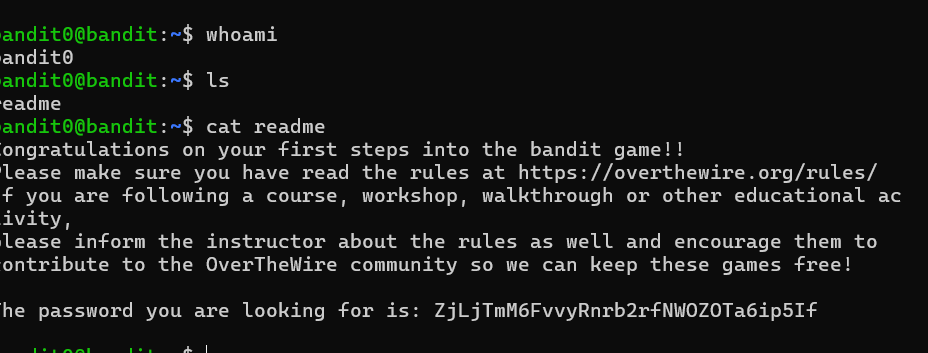

## Level 0-1

This level involves logging into the game using SSH.

SSH (Secure Shell) is a cryptographic network protocol used for securely connecting to and managing remote servers over an unsecured network. It provides a secure, encrypted method for logging in and executing commands on a remote machine, as well as for transferring files safely.  

For this level, the host is `bandit.labs.overthewire.org`, the port is `2220`. The username is `bandit0` and the password is `bandit0`.

### 🔹 Commands Used
```bash
ssh bandit0@bandit.labs.overthewire.org -p 2220
ls
cat readme


### 🔹 Screenshot


