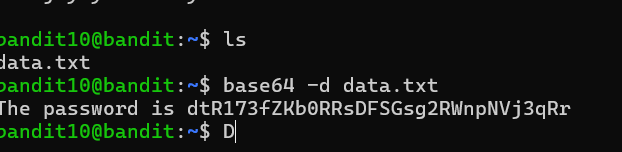
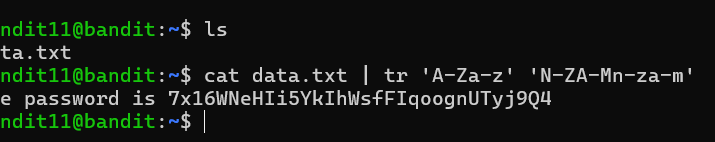
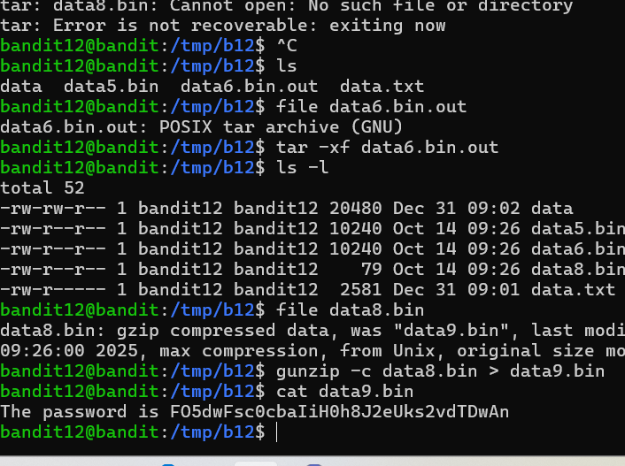
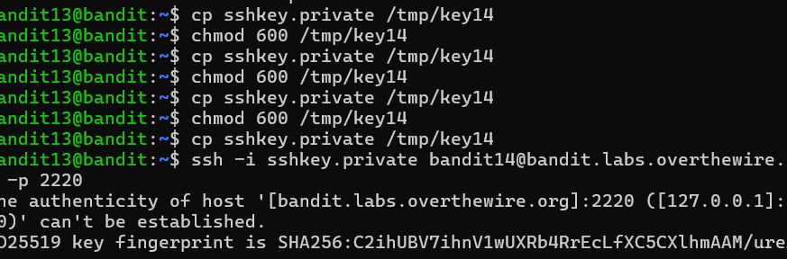
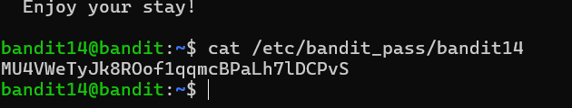
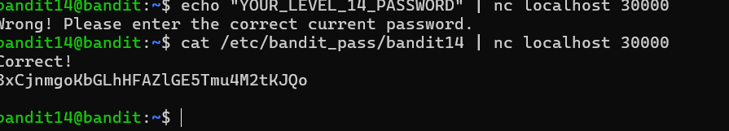
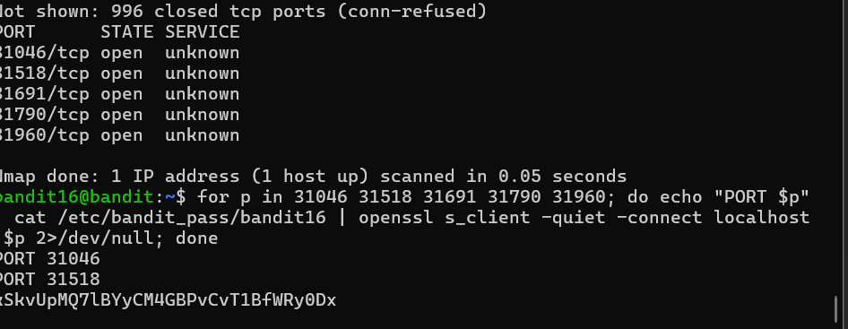

```
# OverTheWire Bandit Write-ups (Levels 10–19)

## Level 10-11

The password for this level is stored in the file `data.txt`, which contains Base64 encoded data.

### 🔹 Commands Used
cat data.txt
base64 -d data.txt

### 🔹 Screenshot


---

## Level 11-12

The password is stored in a file where all lowercase and uppercase letters have been rotated by 13 positions (ROT13).

### 🔹 Commands Used
cat data.txt
cat data.txt | tr 'A-Za-z' 'N-ZA-Mn-za-m'

### 🔹 Screenshot


---

## Level 12-13

The password is stored in a file that has been compressed multiple times using different compression formats.

### 🔹 Commands Used
mkdir /tmp/bandit12
cp data.txt /tmp/bandit12
cd /tmp/bandit12
xxd -r data.txt data
file data
gunzip data
bunzip2 data
tar -xf data
tar -xf data
gunzip data
cat data

### 🔹 Screenshot


---

## Level 13-14

The password is stored in `/etc/bandit_pass/bandit14`, and can be accessed using an SSH private key.

### 🔹 Commands Used
ssh -i sshkey.private bandit14@localhost

### 🔹 Screenshot


---

## Level 14-15

The password can be retrieved by submitting the current password to port 30000 on localhost.

### 🔹 Commands Used
cat /etc/bandit_pass/bandit14
nc localhost 30000

### 🔹 Screenshot


---

## Level 15-16

The password can be retrieved by submitting the current password to a secure SSL connection on port 30001.

### 🔹 Commands Used
openssl s_client -connect localhost:30001

### 🔹 Screenshot


---

## Level 16-17

The password is retrieved by finding the correct SSL service running between ports 31000 and 32000.

### 🔹 Commands Used
nmap localhost -p 31000-32000
openssl s_client -connect localhost:PORT
cat /etc/bandit_pass/bandit17

### 🔹 Screenshot


---

## Level 17-18

The password is the only line that has changed between `passwords.old` and `passwords.new`.

### 🔹 Commands Used
diff passwords.old passwords.new

### 🔹 Screenshot


---

## Level 18-19

The password is stored in `readme`, but logging in normally logs you out immediately.

### 🔹 Commands Used
ssh bandit18@bandit.labs.overthewire.org -p 2220 cat readme

### 🔹 Screenshot


---

## Level 19-20

The password is stored in a file that can be accessed using a setuid binary.

### 🔹 Commands Used
ls -l
./bandit20-do cat /etc/bandit_pass/bandit20

### 🔹 Screenshot

```
